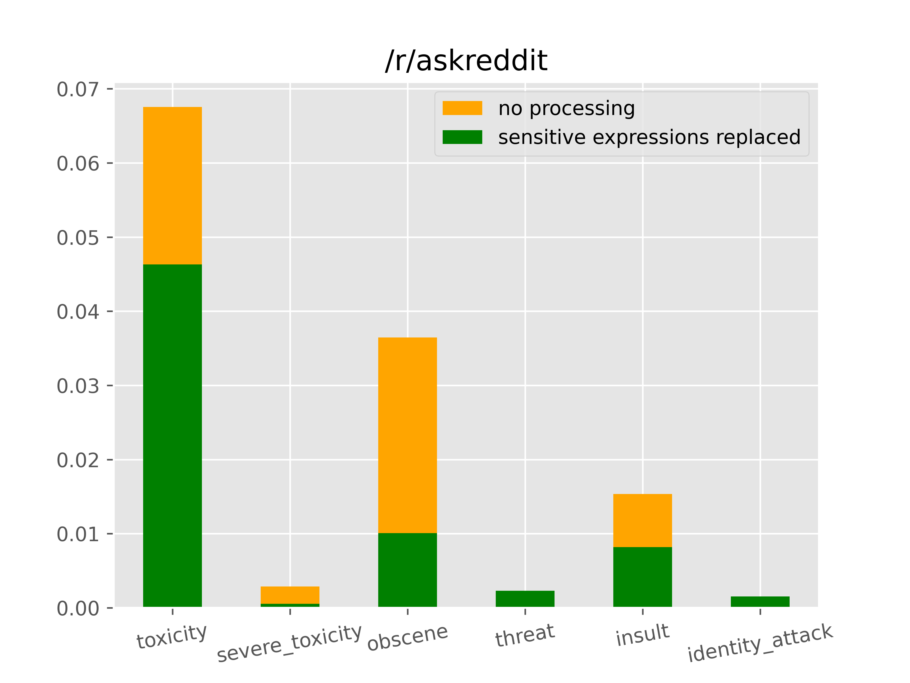
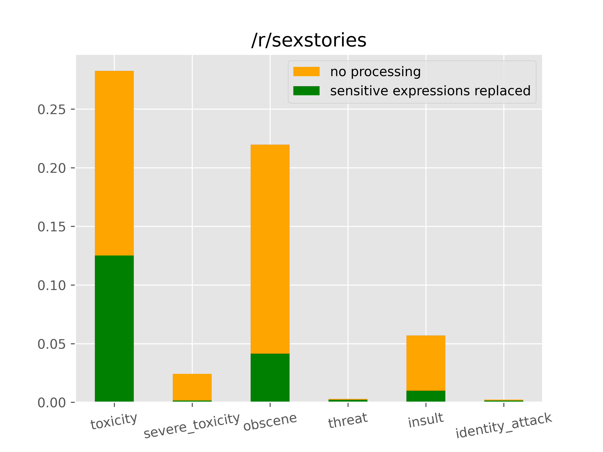

<div align="center">

# 💬Safeworder❤️


<sub><sup>Our icon was made by an AI with craiyon.com</sup></sub>

### Safeworder is a dictionary-based rephrasing tool built on top of `detoxify` and and not only detects sensitive expressions but also replaces them with either the standard safe replacement expressions of `safeworder` or user specified ones. This helps removing or replacing profanity.

</div>

## Performance

Downloading evaluation data from reddit and evaluating it in `main.py` results in the following graphs which show that the judgement mechanism in use - `detoxify` - rates the replaced texts as much less toxic and obscene.

Less obscene subreddit             |  Obscene subreddit
:-------------------------:|:-------------------------:
  |  


## How to install
```
pip install safeworder
```

## How to use
```
from safeworder import NSFWReplacer

rp = NSFWReplacer()
safe_text, replacements = rp.replace("You are an idiot")
print(safe_text, replacements)

>>> "You are a simpleton", {(11, 16): "simpleton"}
```
As a return value you get a tuple of the safer text and a dictionary containing the ranges in the original string where a replacement happened and with which safe expression.


## Using your own mappings

Either create an excel (`.xlsx`) file that and in the table `Sheet1` specify the safe expressions in the first row that expressions in the same column should be replaced with, or use a `json` file that maps each safe expression to a list of its unsafe counterparts. Have a look at `safeworder/mappings/` or `tests/obscenity.json` for reference and use the following code to replace the toxicity and obscenity dictionary respectively.
```
from safeworder import NSFWReplacer
obscenity_replacement = "obsc.json" 
toxicity_replacement = "toxic.xlsx"
rp = NSFWReplacer(obscenity_replacement = file1, toxicity_replacement=file2)
```

## Changing the sensitivity

If `detoxify` does not flag the text, nothing will be replaced. Some words have a negative connotation in general from how `detoxify` was trained, but in everyday use the word does not have to be profane. Here is how to offset this higher baseline suspicion of the model.

```

print(r.replace("You suck!"))
>>> ('You inhale!', {(4, 8): 'inhale'})
print(r.replace("he was sucking lemonade through the straw"))
>>> ('he was inhaling lemonade through the straw', {(7, 14): 'inhaling'})
```
As one can see in the second case `suck` should not be replaced. Here is the fix:
```
tolerances_suck = {"suck": 0.98, "sucks": 0.98, "sucked": 0.98, "sucking": 0.98}
r = NSFWReplacer(tolerances=tolerances_suck)

print(r.replace("You suck!"))
>>> ('You inhale!', {(4, 8): 'inhale'})
print(r.replace("he was sucking lemonade through the straw"))
>>> ('he was sucking lemonade through the straw', {})
```